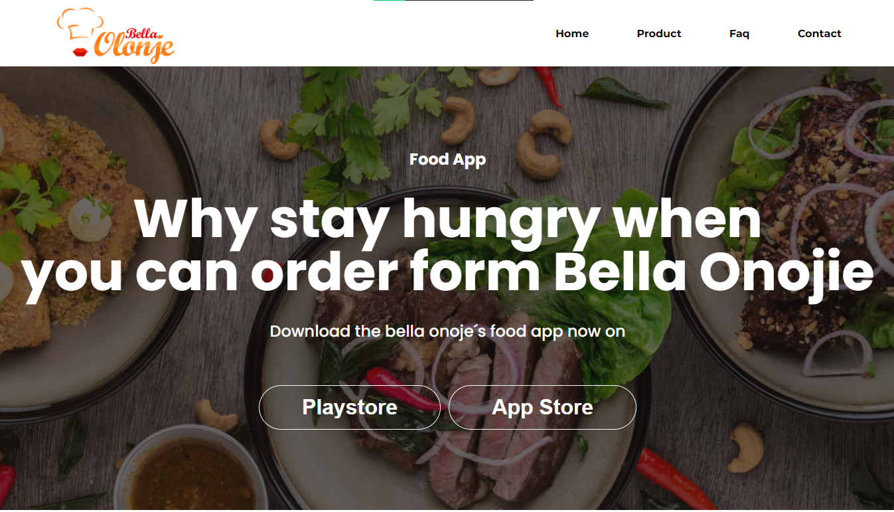
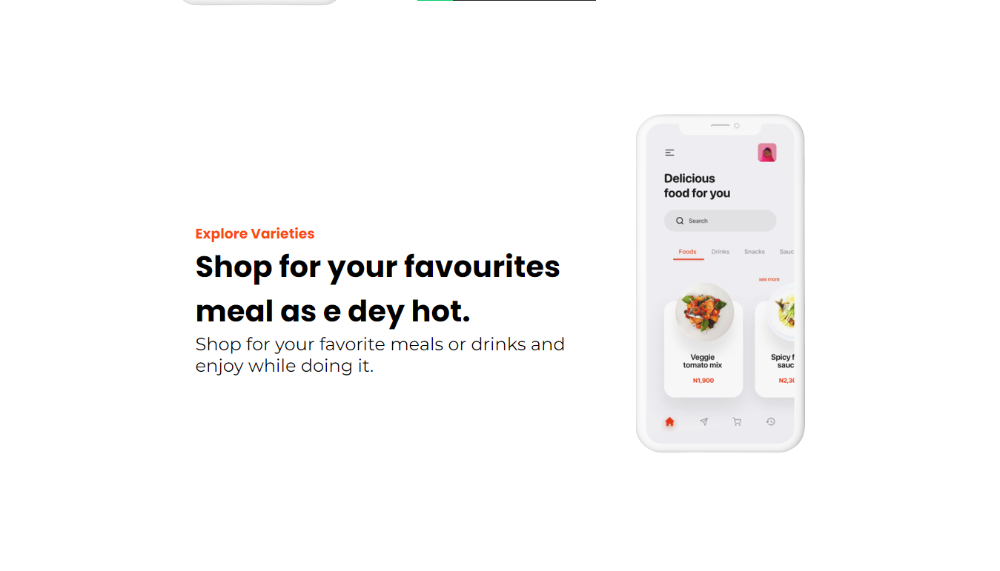
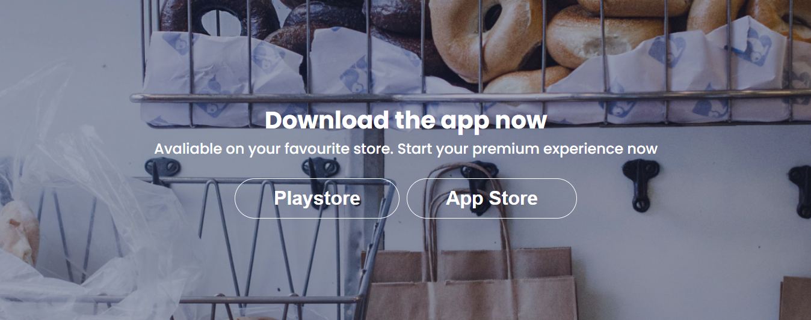

# 🥙 Food App

## ❓ Sobre

Lading Page ilustrativa de um um aplicativo de comida e delivery.

---

## ⭐ Conceitos e Tecnologias

-   HTML5;
-   SASS/SCSS;
-   CSS3;

---

## 🖥 Visualização

---

---

    <a style="color: #195BBD;" href="https://vitorsantos920.github.io/foodApp/" target="_blank">Link de Visualização</a>
    
 &copy; Vitor Santos

